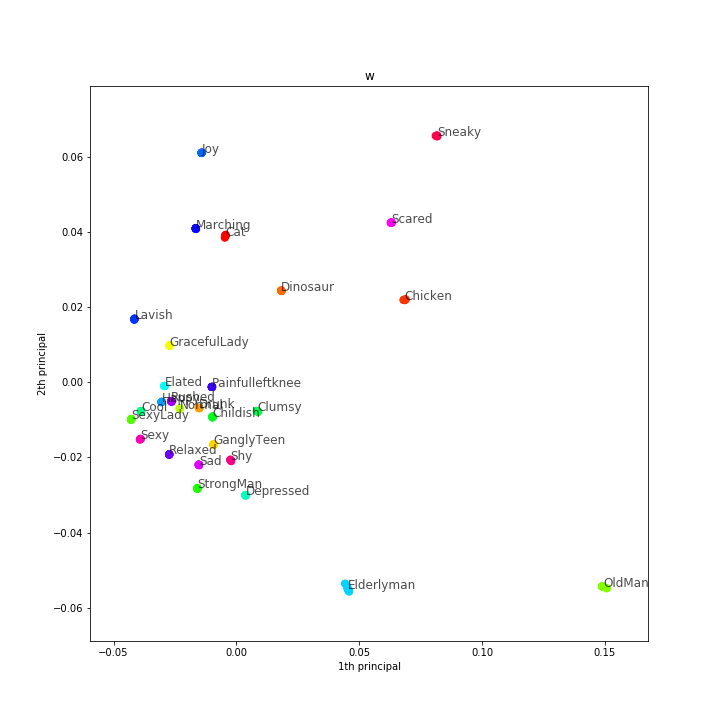
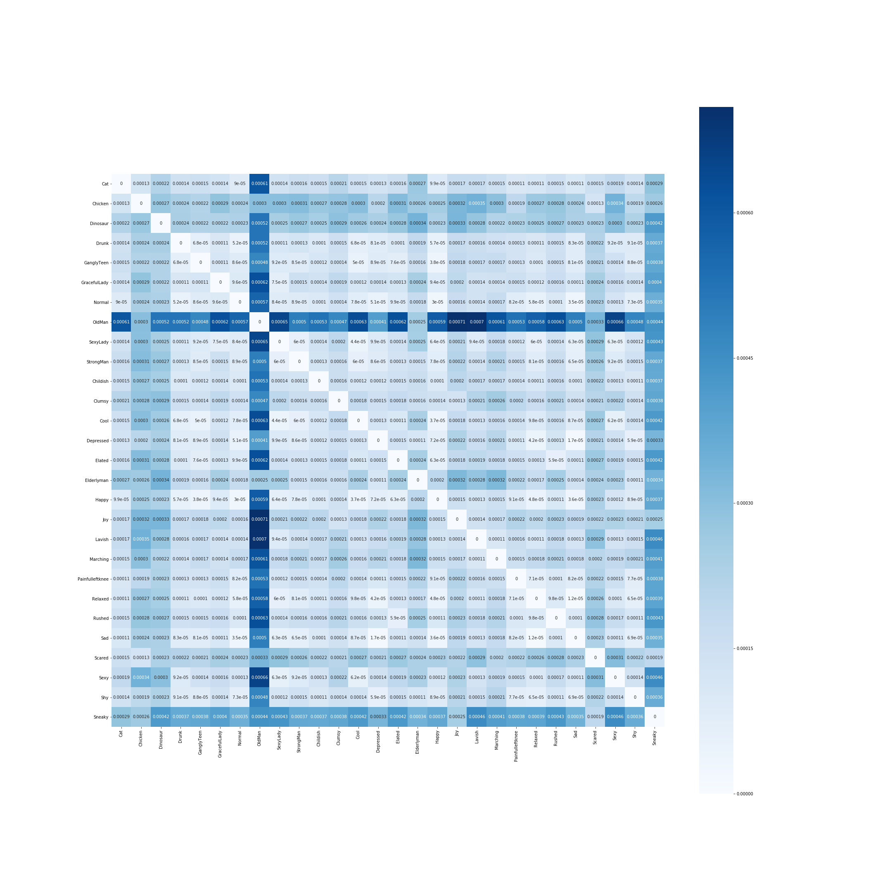
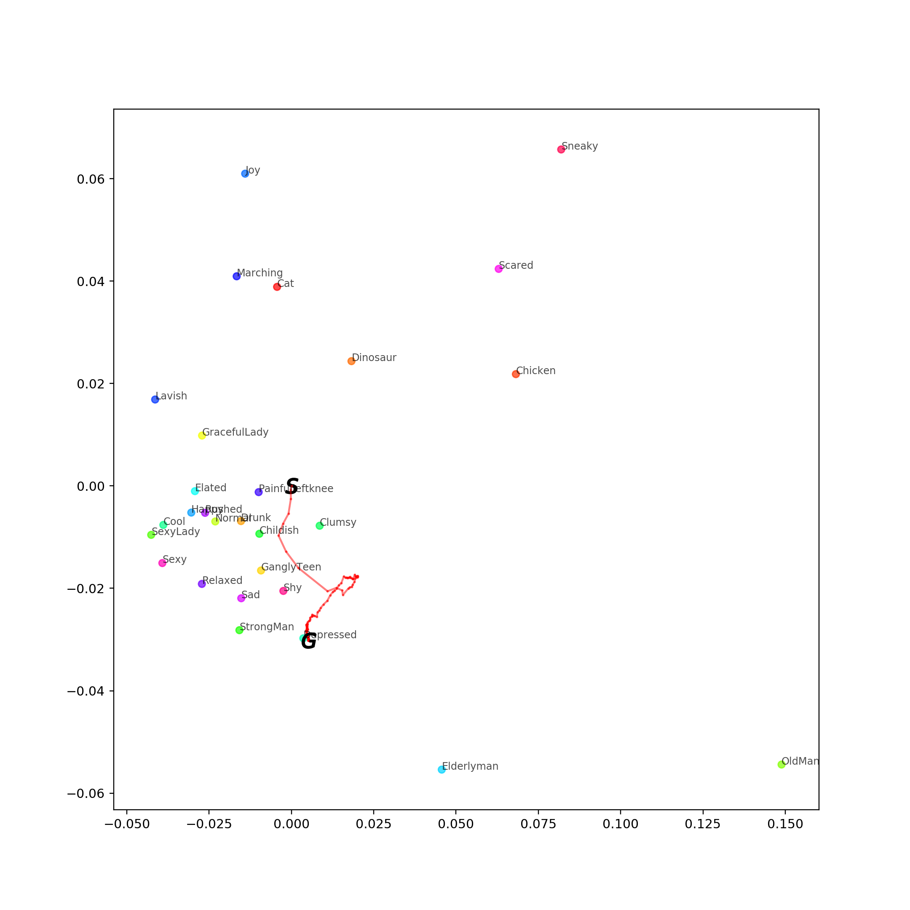

## Requirement
- Python3 (>=3.6)
- Pytorch (>=0.4.1)
- cv2
- scipy
- tensorboardX
- ImageMagick

***
# データセット作成

bvhファイルは`{スタイルの名前}_*.npy`という名前で適当な場所に置いておく。  
(CMUのStyled_Walkデータ：https://drive.google.com/open?id=1FyevwosIAghDoo7YLhtZ_wcmIgRHIyvZ ）  
以下のスクリプトを実行すると、指定した場所に元のbvhファイルのコピーと、joint-positionに変換した動作のnpyファイルが生成される。
```
python make_dataset.py --dataset {ROOT_OF_BVH_FILES} --out {OUTPUT_DIRECTORY}
```
また、正規化等に使用されるSkeleton情報は、デフォルトでは先頭のbvhファイルのものが参照されるが、コマンドラインオプション`--standard_bvh`で指定して任意のファイルを参照することもできる。

### 学習用のPickleファイルの生成
各npyファイルはあくまで動作のjoint positionの情報のみを持っており、学習に必要なスタイルラベルやSpline補間曲線等の情報は適切な前処理で取り出す必要がある。  
この前処理は学習の設定に依存するため、Datasetインスタンスを生成する際に行う(core/datasets.dataset.py参照)が、学習の度に毎回行うにはやや重たい処理である。  
そこで、前処理されたデータをPickleファイルで別々に保存しておき、同様の設定で学習する際はそれを読みだすようにしている。このPickleファイルは、npyファイルと同一の階層に作成される*processed_xxx*"というディレクトリ下に保存される。


***
# 学習
モデルの学習は以下のコマンドにより実行する。
```
python train.py {PATH_TO_CONFIG_FILE}
```
**例**　
```
python train.py config/MotionGAN/Styled_augfps_step8.py
```
特定のcheckpoint(.pth.tar)から学習を再開する場合、コマンドラインオプション`--resume`を用いて指定する。

## Configファイルについて
学習の設定は基本的に全てConfigファイルで扱う。  
Configファイルは辞書の階層構造を取り、core/utils/config.pyに従ってパースされる。  
代表的なプロパティについて説明を以下に載せる。

### モデルの指定
モデル情報はConfigファイルのmodelsプロパティに記載される。以下各プロパティの説明。

**Generator**

| プロパティ| 説明 |
|:---:|:---|
| model | ネットワークの名前　|
| top | 最初のConv層の出力チャネル数 |
| padding_mode | 各Conv層のパディング方法 |
| kw | 各Conv層のKernelサイズ(幅) |
| w_dim | Latent Transformerの出力次元数 |
| use_z | ノイズzの生成方法 (ノイズを用いない場合None) |
| z_dim | ノイズzの次元数 |
| normalize_z | Latent Transformerの入力に対してPixelwiseNormalizationを適用するかどうか |

**Discriminator**  
Generatorと同様のものは省略。

| プロパティ| 説明 |
|:---:|:---|
| norm | Normalizeレイヤを文字列で指定 |
| use_sigmoid | Real/Fakeの出力にSigmoid層を挟むどうか |


### データセットの指定
学習に用いるデータセットはtrain.datasetプロパティで指定する、以下各プロパティの説明。
| プロパティ| 説明 |
|:---:|:---|
| data_root | データセットの場所(root) |
| class_list | データセットに含まれるスタイルクラス一覧 |
| start_offset | 動作データをnpyファイルからロードする際，先頭でスキップするフレーム数 (キャリブレーション用のフレームなど) |
| control_point_interval | Spline補間を行う際のコントロールポイントの間隔(フレーム数) |
| standard_bvh | Skeleton情報を参照するbvhファイル |
| scale | データに対してかけるスケーリングの係数 |
| frame_nums | 学習に用いる1動作シーケンスのフレーム数  (これを↓のstepで割った長さがネットワークの入力長) |
| frame_step | 動作をサンプリングするフレームステップ |
| augment_fps | FPS Augmentationを行うかどうか |
| rotate | y軸を中心とした回転Augmentationを行うかどうか |


***
# テスト
test.pyを用いて、学習モデルを用いた動作生成テストを行うことができる。ただし、より自由な入力からの動作生成や定量評価・統計分析は後述専用のコードで行い、test.pyはどちらかというとValidationに近い目的で、特定のデータセット(∌学習データ)から抽出したControl Signalについて動作を生成するという簡単なテストのみを行う。  

**実行コマンド**
```
python　test.py {PATH_TO_CONFIG_FILE} --weight {PATH_TO_CHECKPOINT} --num_samples {NUMBER_OF_SAMPLES_IN_A_VIDEO} 
```
**例**　
```
python test.py config/MotionGAN/Styled_augfps_step8.py --weight results/MotionGAN/Styled_augfps_step8/checkpoints/iter_99999.pth.tar --num_samples 3
```

Configファイルに関しては、学習と同じ形式で同一ファイル内にtestプロパティとして記載すればよい。

***
# 分析
analyze.pyでは学習したモデルの中間出力について、PCAやtSNEを用いた分析を行える。
```
python　analyze.py {PATH_TO_CONFIG_FILE} --weight {PATH_TO_CHECKPOINT} --mode {WHICH METHOD TO APPLY} --target {TARGET_FEATURE} ...
``` 
手法は`--mode`オプションで指定する。PCA・tSNEの他に、クラスタの重心間の距離行列をheatmapで可視化する"heatmap"というモードが指定できる。  
`--target`オプションでは目的の中間出力(Latent Transformの出力**w**やAdaINの出力(層名で指定))を指定する。 

また、PCAとtSNEでは可視化したい主成分のペアを`--components`オプションでx-yの形で順に指定すると、それぞれに対応する複数のグラフが1つのファイルに出力される。  
**例**　第1&2主成分、第2&3主成分、第3&4主成分を可視化したグラフを出力したい場合。
```
python　analyze.py {PATH_TO_CONFIG_FILE} --weight {PATH_TO_CHECKPOINT} --mode pca --target w --components 1-2,2-3,3-4
```

 

左：Latent Transformの出力**w**をPCAで可視化。　右：クラスタの重心の距離をheatmapで可視化。

*** 
# 定量評価
Trajectory errorやFoot skate distanceなどの指標を用いた定量評価を行うことができる。
```
python eval_quantitative.py {PATH_TO_CONFIG_FILE} --weight {PATH_TO_CHECKPOINT}
```
実行すると、Configで指定したテストデータについて評価を行い、結果のcsvが出力先フォルダの/eval/以下に保存される。

***
# Style Latent Vectorの探索
style_search.pyでは最適化による動作からのスタイル推定を行う。  
具体的には、対象の動作データ(.npyまたは.pkl)と学習済みモデルを指定すると、モデルの出力が対象動作に近くなるように、Latent Vector **w**そのものを最適化する。なお、最適化のハイパーパラメータはコード中で指定している。
```
python style_search.py {PATH_TO_CONFIG_FILE} --weight {PATH_TO_CHECKPOINT} --target {PATH_TO_TARGET_FILE} 
```
実行すると、PCAで圧縮した2次元平面上での最適化の軌跡を示したpdfが保存される。また、`--save_video`オプションをつけると、対象の動作・獲得したLatent Vectorに基づく生成動作・(対象のスタイルで生成した動作)を可視化した動画を生成できる。


